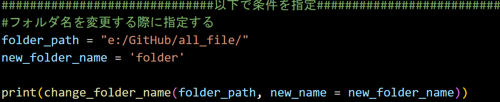
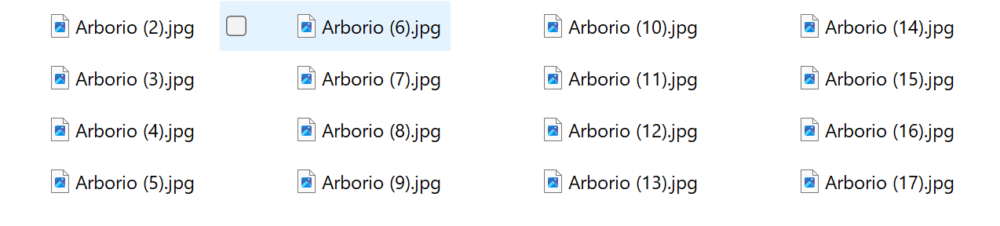
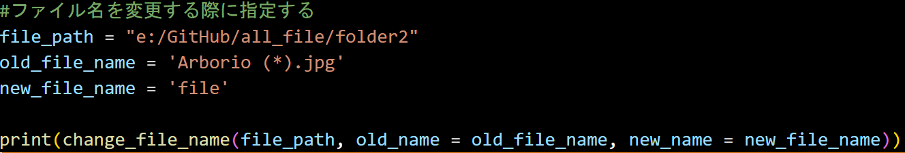
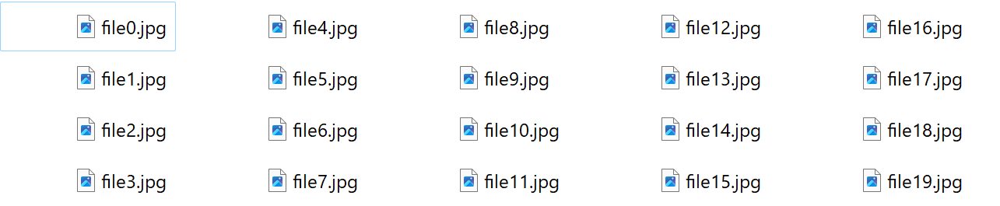

# f_name_changerの使用方法
このプログラムは複数のフォルダやファイルがある場合に，それらの名前に連番を付与して整理するときや並び替えの際に役立ちます．

以下に実際の手順を示す．
## フォルダ名を変更する場合
#### 変更前のフォルダは以下のようになっている.

#### 今回の例では，このフォルダに連番を付けて整理する．

### コード内で指定を行う箇所について以下のコードを用いて1.~3.で説明する．

#### 1. 名前を変更したいフォルダが存在するパスをfolder_pathに指定する．
#### 2. 新たなフォルダ名のkeyとなる名前をnew_folder_nameに指定する．

##### 今回は新たなフォルダ名のkeyを'folder'に設定した．

#### 3. 実行すると，'key+連番'でフォルダ名が変更されている．

## ファイル名を変更する場合

#### 変更前のファイルは以下のようになっている.

#### 今回の例では，この画像ファイルの名前を好きなように変更する．

### コード内で指定を行う箇所について以下のコードを用いて1.~3.で説明する．

#### 1. 名前を変更したいファイルが存在するパスをfile_pathに指定する．
#### 2. 変更したい画像に共通する名前をold_file_nameに指定する．

##### 今回は共通の名前である'Aruborio (*).jpg'を設定した．

##### 現在のファイル名に規則がなければ'*.jpg'のようにワイルドカードを設定しておくとよい．

#### 3. 新たなファイル名のkeyとなる名前をnew_file_nameに指定する．

##### 今回は新たなファイル名のkeyを'file'に設定した．

#### 4. 実行すると，'key+連番.拡張子'でファイル名が変更されている．

